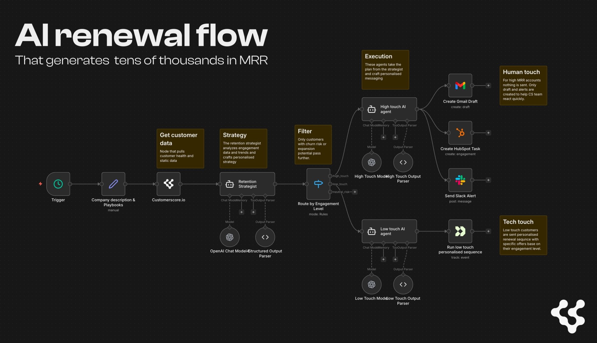
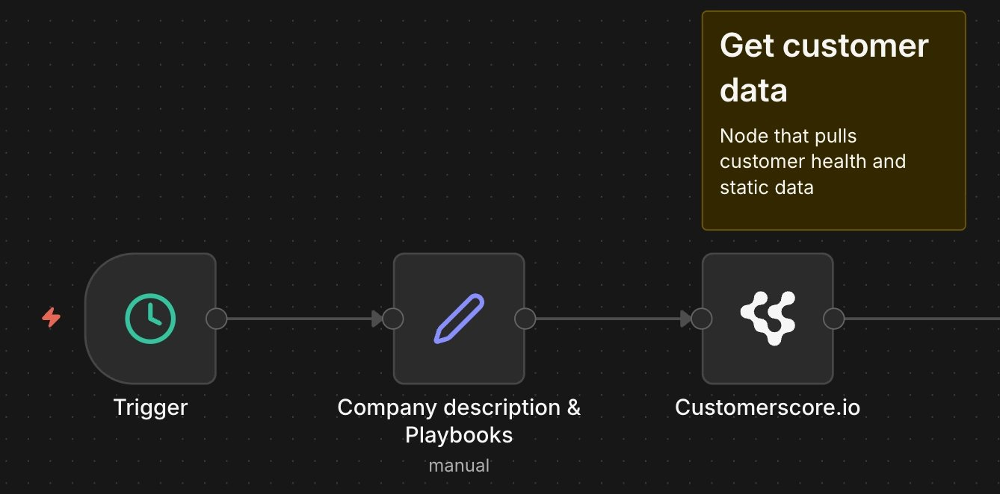
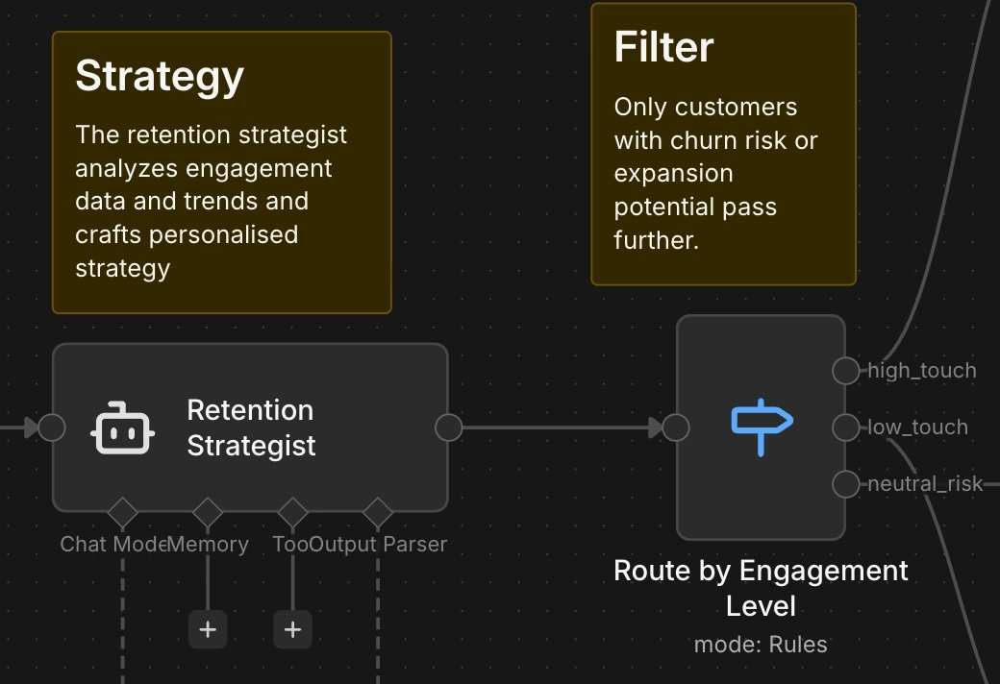
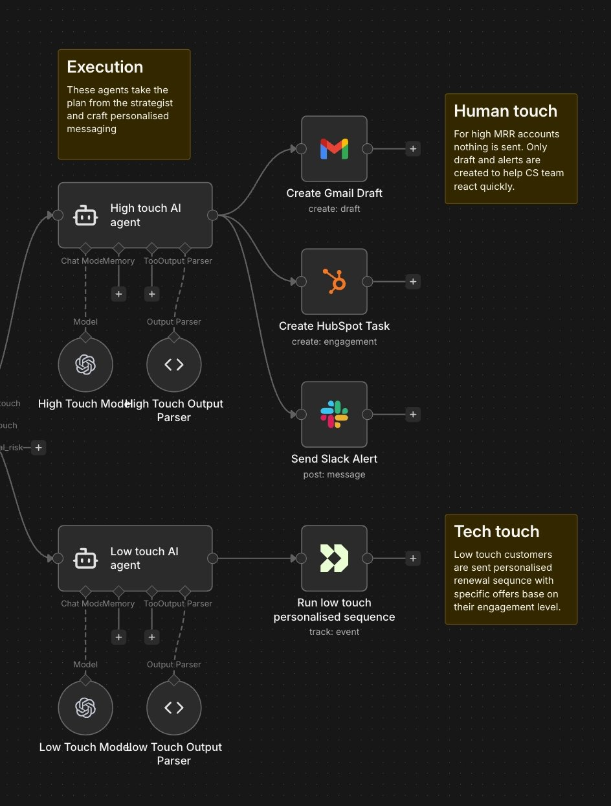

# AI Renewal automation for SaaS (n8n template)

### 1️⃣ Wakes up every morning

### 2️⃣ Pulls customers close to renewal

### 3️⃣ Analyzes churn risk and expansion signals

### 4️⃣ Creates retention strategy

- **For Big accounts**: drafts emails, creates HubSpot tasks, sends Slack alerts
- For **Low touch**: Triggers personalized email sequence

## What This Template Does

This n8n workflow automatically pulls customers who are about to renew, analyzes the customer health data and executes personalized retention strategies at scale. It combines AI decision-making with automated outreach to save at-risk customers and identify expansion opportunities.

**Key capabilities:**

- Analyzes customer health and usage trends
- Deducts key opportunities and risks
- Drafts super personalized email drafts for CSMs to send
- Handles low-value accounts via automated email campaigns
- Personalizes all outreach using your company's playbooks and talking points

## n8n template .json

You can load this into your n8n and customize the flow

> 🆘 **Need this, but cannot use n8n?**
> No worries. We can help you implement this workflow and set-up health scoring.

---

## How It Works

### 1. **Data Collection**

The workflow pulls customer data from CustomerScore.io (or your customer health platform) including:

- Engagement scores and trends
- Seat utilization and usage metrics
- Support ticket patterns
- Time in product, features adopted, integrations enabled

### 2. **AI Strategic Analysis**

The **Retention Strategist** AI agent analyzes each customer holistically and determines:

- **Strategic Segment**: Churn Risk / Expansion / Neutral
- **Engagement Level**: High-Touch (human CSM) / Low-Touch (automation)
- **Urgency**: Immediate / High / Moderate / Low
- **Key Risks & Opportunities**: Specific insights about each customer
- **Recommended Actions**: Tactical next steps based on your playbooks

### 3. **Intelligent Routing**

**High-Touch Path**

- **AI drafts personalized email** using your playbook talking points
- **Creates HubSpot task** for CSM follow-up with full context
- **Sends Slack alert** to CSM team with urgency level and action required

**Low-Touch Path** (for lower-value accounts):

- **AI selects optimal Customer.io campaign** based on situation
- **Sends event trigger** with personalization data (pain points, opportunities, offer type)
- **Customer receives automated sequence** tailored to their specific needs

**Neutral Path** (healthy customers):

- Does not trigger anything in this flow

---

## Setup Guide

### Step 1: Import the Template

1. Download the `CustomerScore.io Renewal Flow` file
2. In n8n, click **+ → Import from File**
3. Select the downloaded JSON file
4. The workflow will appear with all nodes pre-configured

### Step 2: Connect Your Customer Health Platform

**Option A: Using CustomerScore.io**

- If you are current customer message us and we help you set this up

**Option B: Using another platform**

- You can use this by combining data from Mixpanel + Stripe (just example), but this will require some heavy lifting on you side. [Customerscore.io](http://Customerscore.io) does the data heavy lifting here.

> 🚥 **Not scoring your customers health yet?**
> [Customerscore.io](http://Customerscore.io) uses custom Machine learning to score your customers and power workflows like this one.

### Step 3: Configure Your Credentials

Update these credential IDs in the workflow:

**OpenAI API** (3 nodes need this):

- Retention Strategist Model
- High Touch Model
- Low Touch Model

**Gmail** (1 node):

- Gmail node

**HubSpot** (1 node):

- HubSpot Task node

**Slack** (1 node):

- Send Slack Alert node
- Also update the channel ID to your CSM team channel

**Customer.io** (2 nodes):

- Customer.io Low Touch
- Customer.io Neutral

### Step 4: Customize Your Playbooks

**Edit the "Company description & Playbooks" node:**

1. Click on the Set node named **"Company description & Playbooks"**
2. Update the **Company description** field:
    - Replace "DealFlow Pro" with your company/product name
    - Update metric definitions to match YOUR metrics
    - Define what "healthy" vs "unhealthy" looks like for YOUR product
    - Include your specific feature names and terminology
3. Update the **Retention playbooks** field:
    - Add your churn risk intervention strategies
    - Include your expansion/upsell tactics with pricing tiers
    - Add specific talking points your CSMs should use
    - Include ROI calculations and value props for each tier

**Why this matters:** The AI agents reference these playbooks directly when drafting emails and selecting campaigns. Your actual company language makes the outreach feel authentic, not generic.

### Step 5: Test the Workflow

**Test with a single customer:**

1. Click **"Execute Workflow"** in n8n
2. The workflow will process one customer through the entire flow
3. Check the outputs at each stage:
    - ✅ Retention Strategist correctly identifies segment and touch level
    - ✅ High-Touch creates draft email in Gmail
    - ✅ High-Touch creates task in HubSpot
    - ✅ High-Touch sends Slack alert to correct channel
    - ✅ Low-Touch sends correct event to Customer.io
    - ✅ Neutral sends renewal_nurture event
4. Verify the AI-generated content is high quality:
    - Does the email reference actual customer data?
    - Are the talking points from your playbook?
    - Is the Slack alert actionable?

**Common issues:**

- **"Cannot read property 'name' of undefined"** → Check that CustomerScore data includes all required fields
- **Gmail draft not created** → Verify Gmail credentials and permissions
- **Slack message fails** → Confirm channel ID is correct
- **Customer.io event not received** → Check API credentials and event names match your campaigns

### Step 7: Set Up Automation

**Schedule the workflow to run automatically:**

1. Add a **Schedule Trigger** node at the beginning
2. Configure run frequency:
    - **Daily** - Standard for most companies (checks all customers once per day)
    - **Twice daily** - For high-velocity businesses
    - **Weekly** - For longer sales cycles
3. Add a **Limit** node after the trigger to control batch size:
    - Start with 10 customers per run while testing
    - Increase to 50-100 once stable
    - Monitor OpenAI API costs

**Pro tip:** Set up separate workflows for different customer segments:

- **Critical Customers** - Run daily for accounts >$5K MRR or <14 days to renewal
- **Standard Customers** - Run 2x/week for most accounts
- **Low-Value Customers** - Run weekly for <$500 MRR

---

## Customization Ideas

### Adjust MRR Thresholds

The default high-touch threshold is **$1,500 MRR**. To change it:

1. Edit the **Retention Strategist** system prompt
2. Find the "High-Touch" definition section
3. Update: `High MRR customers (≥$1,500/month)` to your threshold
4. Also update examples at the bottom of the prompt

### Add More Channels

**Want to add SMS alerts?**

1. Add a Twilio node after the High-Touch AI Agent
2. Connect it parallel to Gmail/HubSpot/Slack
3. Reference `$json.output.slack_message.text` for content

**Want to post to a Notion database?**

1. Add a Notion node after the Retention Strategist
2. Create a new database entry with customer analysis
3. Use for CSM review dashboards

### Add Human-in-the-Loop Approval

For critical accounts, require CSM approval before sending:

1. Add a Wait node after AI agent
2. Send approval request via email/Slack
3. CSM clicks "Approve" or "Edit"
4. Workflow proceeds or pauses for manual adjustment

---

# Done-For-You Setup

**Want us to set this up for you?**

We offer white-glove implementation of this retention automation:

- ✅ Custom playbook development based on your product
- ✅ CustomerScore.io configuration and health scoring
- ✅ Customer.io campaign design and copywriting
- ✅ Full workflow setup and testing
- ✅ 30-day optimization and tuning

**Interested?** 👉 [Book a call](https://www.customerscore.io/book-a-demo) or email us at [patrik@customerscore.io](mailto:patrik@customerscore.io)
